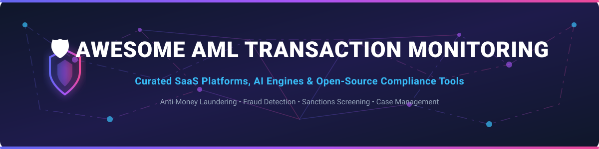

  

# 🛡️ Awesome AML Transaction Monitoring Ecosystem

  
  
  
  

**Curated Directory of Anti-Money Laundering (AML) Transaction Monitoring SaaS Products & Open-Source GitHub Repositories**  

> 💡 **Anti-Money Laundering (AML) & Financial Crime Compliance:** Discover enterprise-grade SaaS platforms, AI-driven transaction monitoring engines, rule engines, sanctions & PEP screening tools, and open-source compliance frameworks.

---

## 📑 Table of Contents
- [📊 SaaS & Commercial Platforms](#-saas--commercial-platforms)
- [💻 Open-Source GitHub Repositories](#-open-source-github-repositories)
- [🤝 How to Contribute](#-how-to-contribute)
- [☕ Support & Community](#-support--community)
- [📈 Star History](#-star-history)
- [⚠️ Disclaimer](#%EF%B8%8F-disclaimer)

---

## 📊 SaaS & Commercial Platforms

> 📈 **Market Size & Structure:**  
> The global AML software market size was estimated at **USD 3.2 Billion in 2024** and is projected to reach **USD 7.4 Billion by 2030** (CAGR of ~15%).  
> **Market Fragmentation:** The sector is **moderately fragmented**. High-end tier-1 global banks are dominated by legacy enterprise incumbents (NICE Actimize, Oracle, Feedzai), while fast-growing fintechs, neobanks, and mid-market institutions rely on modern, API-first RiskOps platforms (Unit21, Flagright, ComplyAdvantage, AMLYZE).

### 🏢 Commercial SaaS Platforms Comparison

Below is a curated comparison of leading SaaS AML Transaction Monitoring platforms, ordered by **Company Scale / Valuation (Descending)**:

| Platform 🚀 | Annual Revenue / Valuation 💰 | Starting Pricing 🏷️ | Free Tier / Trial Limit 🎁 | Key Features & Focus ⚡ |
| :--- | :--- | :--- | :--- | :--- |
| **[NICE Actimize](https://www.niceactimize.com/)** | **~$2.5B Valuation** ($453.5M Rev) | Starts from **~$100,000 / year** (Enterprise Contract) | **30-Day Guided Enterprise Sandbox** | Enterprise AI transaction monitoring, case management & regulatory reporting for Tier-1 banks. |
| **[Feedzai](https://www.feedzai.com/)** | **>$2.0B Valuation** (~$31M ARR) | Starts from **~$50,000 / year** (Custom Enterprise volume) | **14-Day Proof-of-Concept Demo Sandbox** | AI-powered RiskOps platform protecting high-volume payment processors & retail banks. |
| **[Unit21](https://www.unit21.ai/)** | **~$650M Valuation** (Series C) | Starts from **~$30,000 / year** (Tiered API volume) | **14-Day Free Developer Sandbox Trial** | No-code transaction monitoring, risk scoring & automated SAR filing workflow engine. |
| **[ComplyAdvantage](https://complyadvantage.com/)** | **~$141M Valuation** (~$27M ARR) | Starts from **~$15,000 / year** ($1,250/mo base tier) | **14-Day Free API Access Trial** (100 free screening credits) | Real-time AML data, transaction monitoring, ongoing watchlist & PEP screening. |
| **[Flagright](https://www.flagright.com/)** | **~$12.5M Series A** (~$4.1M ARR) | Starts from **~$15,000 / year** ($1,250/mo starter tier) | **Startup Program:** Free access for 12 months for eligible early-stage startups; 14-day free trial. | API-first no-code transaction monitoring & real-time AML compliance platform for fintechs. |
| **[AMLYZE](https://amlyze.com/)** | **~$2.5M Seed Raised** (~$2.9M Rev) | Starts from **€500 / month** (Mid-market starter tier) | **14-Day Free Trial** (Includes 500 test transaction runs) | SaaS suite for transaction monitoring, risk scoring, screening & case management for EMIs/fintechs. |

---

## 💻 Open-Source GitHub Repositories

Below are key open-source repositories for building custom transaction monitoring pipelines, graph analytics, watchlist search, and ML compliance risk models, ordered by **Stars_Count (Descending)**:

| Repository 📦 | GitHub_Stars ⭐ | Description 📝 |
| :--- | :--- | :--- |
| **[checkmarble/marble](https://github.com/checkmarble/marble)** |  | Open-source real-time decision engine for fraud detection, AML transaction monitoring & sanctions screening workflows. |
| **[moov-io/watchman](https://github.com/moov-io/watchman)** |  | Open-source search engine for global watchlists, sanctions lists (OFAC, EU, UN), and PEP screening. |
| **[mine-ai-xyz/mine-ai](https://github.com/mine-ai-xyz/mine-ai)** |  | Open-source AI reference implementations for payment security, blockchain fraud detection & AML compliance reasoning. |
| **[IBM/Multi-GNN](https://github.com/IBM/Multi-GNN)** |  | Multi-Graph Neural Network (GNN) architectures designed specifically for Anti-Money Laundering graph detection. |
| **[jube-home/aml-fraud-transaction-monitoring](https://github.com/jube-home/aml-fraud-transaction-monitoring)** |  | Full open-source (AGPLv3) machine learning & rules-based real-time AML transaction monitoring and case management system. |
| **[issacchan26/AntiMoneyLaunderingDetectionWithGNN](https://github.com/issacchan26/AntiMoneyLaunderingDetectionWithGNN)** |  | Graph Attention Network (GAT) implementation for money laundering pattern recognition in transaction networks. |
| **[Das00130/Anti-Money-Laundering-using-Keras](https://github.com/Das00130/Anti-Money-Laundering-using-Keras)** |  | Deep learning classification models using Keras for identifying illicit transaction patterns. |

---

## 🤝 How to Contribute

We welcome contributions from compliance professionals, financial engineers, and software developers!

1. 🍴 **Fork** this repository.
2. 📝 **Add or edit** entries in `README.md` following the table formatting.
3. 🔍 Ensure descriptions are clear, accurate, and relevant to AML, Fraud Detection, or Transaction Monitoring.
4. 🚀 Submit a **Pull Request (PR)** with a clear summary of changes.

---

## ☕ Support & Community

If you find this repository helpful for your compliance research, engineering project, or fintech product development, please consider showing your support:

- ⭐ **Star** this repository to help others discover it!
- 🔀 **Fork** it to keep a copy for your own reference.
- 📢 **Share** it with your network on LinkedIn, Twitter/X, and Reddit.
- ☕ **Buy me a coffee / Sponsor:** Support ongoing maintenance via [GitHub Sponsors](https://github.com/sponsors/ishandutta2007).

---

## 📈 Star History

---

## ⚠️ Disclaimer

- This curated directory is maintained for informational and research purposes only.
- Anti-Money Laundering (AML) compliance is a strict legal requirement across jurisdictions. Using open-source components does not guarantee regulatory compliance without proper model validation, audit trails, and human-in-the-loop oversight.
- Always consult qualified legal and compliance professionals before deploying financial monitoring software in production.
